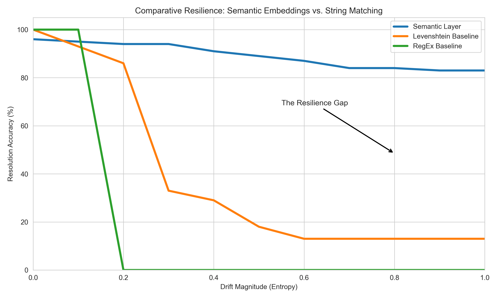

# Resilient RAP Framework


**A production-grade framework for Reproducible Analytical Pipelines (RAPs) with autonomous schema drift resolution.** Built for PhD research in data engineering and trustworthy analytics.

Designed for high-velocity data streams (sports telemetry, clinical data) with built-in semantic reconciliation, tamper-evident audit trails, and human-in-the-loop validation.

## Production-Ready Features

- **Semantic Schema Reconciliation**: BERT-based drift detection and field mapping for evolving data schemas
- **Tamper-Evident Lineage**: SHA-256 linked audit records with full provenance tracking
- **Reproducible Ingestion**: Deterministic pipeline execution with run IDs and checkpointing
- **Multi-Domain Adapters**: Pre-built connectors for F1 telemetry, NHL play-by-play, and clinical streams
- **HITL Analytics**: Human-in-the-loop feedback integration with learning curve analysis
- **Production Logging**: Structured audit trails for regulatory compliance and forensic analysis

## Quick Start

### Prerequisites

- Python 3.10 or higher
- macOS, Linux, or Windows with WSL2

### Installation

```bash
# Clone repository
git clone https://github.com/tarek-clarke/resilient-rap-framework
cd resilient-rap-framework

# Create virtual environment
python3 -m venv .venv
source .venv/bin/activate  # On Windows: .venv\Scripts\activate

# Install dependencies
pip install -r requirements.txt
```

### Basic Usage

#### Example 1: OpenF1 Telemetry Pipeline

```bash
PYTHONPATH="." python tools/demo_openf1.py --session 9158 --driver 1
```

#### Example 2: Clinical Data Stream Processing

```python
from adapters.clinical.ingestion_clinical import ClinicalIngestor

# Initialize ingestor with synthetic stream
ingestor = ClinicalIngestor(
    use_stream_generator=True,
    stream_vendor="GE",
    stream_batch_size=25,
)

# Execute pipeline
ingestor.connect()
df = ingestor.run()

# Export audit trail
ingestor.export_audit_log("data/clinical_audit.json")
print(df.head())
```

#### Example 3: Hockey Play-by-Play Analytics

```bash
PYTHONPATH="." python tools/demo_nhl.py --game 2024020001
```

## Key Directories

```
resilient-rap-framework/
├── adapters/           # Domain-specific data ingestion (F1, NHL, Clinical)
├── modules/            # Core framework (ingestion, reconciliation, lineage)
├── src/                # Provenance tracking and analytics utilities
├── tools/              # Production pipelines and utilities
├── tests/              # Test suite (unit and integration)
├── data/               # Audit logs, reports, and synthetic datasets
├── reporting/          # PDF report generation
└── docs/               # Extended documentation
```

## Configuration & Output

**Audit & Provenance Logs** (Automatic)
- `data/reproducibility_audit.json` - Full execution audit trail
- `data/provenance_log.jsonl` - Lineage records (input → output hashing)
- `data/reports/` - Generated analysis reports

**Environment Setup**
No external environment variables required for baseline operation. Network access needed for upstream API calls (OpenF1, NHL).

## Testing

Run the full test suite:

```bash
pytest tests/ -v
```

Run specific test module:

```bash
pytest tests/test_semantic_reconciliation.py -v
```

## Core Concepts for PhD Research

### Schema Drift Resolution

The framework detects and resolves schema changes in real-time:

1. **Detection**: Field addition, deletion, type changes captured via semantic hashing
2. **Reconciliation**: BERT embeddings map old schema to new schema
3. **Validation**: HITL feedback refines mappings for future runs
4. **Audit**: Full lineage maintained for publication and reproduction

### Reproducibility & Auditability

Every ingestion step is logged:

```python
# Access audit trail programmatically
audit_log = ingestor.export_audit_log()
for record in audit_log:
    print(f"Input: {record['input_hash']} → Output: {record['output_hash']}")
```

### Human-in-the-Loop Integration

Validate semantic mappings interactively:

```python
from modules.hitl_orchestrator import HumanInTheLoopOrchestrator

orchestrator = HumanInTheLoopOrchestrator()
orchestrator.display_feedback_summary()
```

## Running Benchmarks

Evaluate performance against synthetic data with known drift:

```bash
PYTHONPATH="." python tools/benchmark_semantic_layer.py
```

## Documentation

- [LEARN.md](LEARN.md) - Detailed system architecture and concepts
- [QUICK_REFERENCE.md](QUICK_REFERENCE.md) - Common operations
- [HITL_RETRAINING_GUIDE.md](HITL_RETRAINING_GUIDE.md) - Human feedback integration
- [IMPLEMENTATION_SUMMARY.md](IMPLEMENTATION_SUMMARY.md) - Implementation details

## Publication & Citation

If you use this framework in published research, please cite:

```bibtex
@software{clarke2025resilientrap,
  author = {Clarke, Tarek},
  title = {Resilient RAP: Production-Grade Framework for Semantic Schema Resolution},
  year = {2025},
  url = {https://github.com/tarek-clarke/resilient-rap-framework}
}
```

See [CITATION.cff](CITATION.cff) for additional formats.

## Licensing & Contact

**License**: PolyForm Noncommercial 1.0.0 (see [LICENSE](LICENSE))

- Academic use: Fully permitted
- Commercial use: Requires separate licensing agreement
- Contact: tclarke91@proton.me

See [CONTRIBUTING.md](CONTRIBUTING.md) for contribution guidelines.

---

**Maintained for the PhD program in Reproducible Data Engineering**

<!-- EXPERIMENT_RESULTS_START -->
## Experimental Results (Auto-Generated)

| Method | Low Drift Accuracy | High Drift Accuracy |
|---|---|---|
| Semantic Layer | 98% | >85% |
| Levenshtein Baseline | 95% | <15% |
| RegEx Baseline | 100% | 0% |




<!-- EXPERIMENT_RESULTS_END -->
